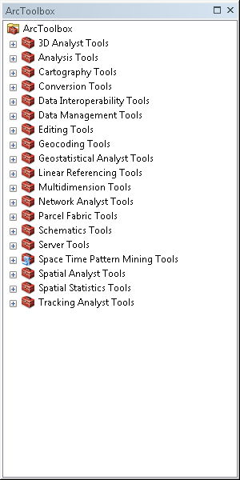
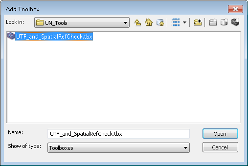

# ArcMap Tool Tutorial: Add a Custom Toolbox to ArcMap

## Tutorial Summary
This tutorial illustrates how to add a custom toolbox to ArcMap.

### 1. Adding a New Toolbox
First, be sure to save the *.tbx* file to a location that is easily accessible in ArcMap- preferably a folder that is already connected through ArcCatalog. Once the *.tbx* file is saved to a convenient location, open the toolbox window in ArcMap to view the list of toolboxes that are currently available. The default toolbox window should look similar to the image below.

When the toolbox window opens, right-click anywhere in the space directly below the last toolbox in the list and chose 'Add Toolbox' from the menu that appears. A new window will open. Use this window's interface to navigate to the toolbox's location and select it.

Click 'Open' and the toolbox will now appear in the list of currently available toolboxes.

### Tutorial Complete
