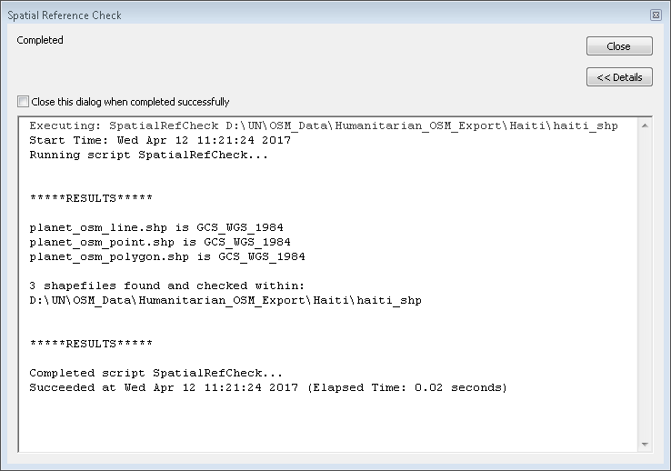

# ArcMap Tool Tutorial: Spatial Reference Check

## Spatial Reference System Check Script Summary
The *Spatial Reference System Check* script reports the Spatial Reference System of each shapefile within a folder. The script works by first identifying each *.shp* file within the specified folder, then the script identifies the Spatial Reference System used by each shapefile. The Spatial Reference System for each shapefile is then reported to the user in the Details pane of the Results dialog box that appears when the script is used in ArcMap v10.0 or newer.

### 1. Files to be Processed

For this example, there are three different types of shapefiles (line, point, polygon) within a folder titled *Haiti_shp*. The *Spatial Reference Check* script will report each shapefile's spatial reference system when used in ArcMap.

### 2. Opening the Spatial Reference System Check Script
To open the script, double-click the *Spatial Reference Check* script within the *UTF and Spatial Ref Check* toolbox.

When the *Spatial Reference Check* script interface is displayed, it should look like the image below.

### 3. Specifying the Folder to Evaluate & Executing the Script
Navigate to the folder that contains the shapefiles that you wish to check the spatial reference system of. In this tutorial, the folder to specify is the *Haiti_shp* folder. Click 'Add' then 'OK' to run the *Spatial Reference Check* script on each shapefile within the specified folder.

Note: The *Spatial Reference Check* script does not evaluate any shapefiles that may be within sub-folders.

### 4. Viewing the Results
Once the *Spatial Reference Check* script has finishing running, it will display the name and spatial reference system of each shapefile. Check the displayed results to ensure that each shapefile is using the correct spatial reference system. In this tutorial, all three shapefiles are using *GCS_WGS_1984*.

Note: If the results window closes automatically, the results can also be found in the *Geoprocessing Results Window* which can be activated by clicking *Geoprocessing -> Results* from the menu bar found at the top of the screen.

	Executing: SpatialRefCheck "D:\UN\OSM Data\Humanitarian OSM Export\Haiti\haiti_shp"

	Running script SpatialRefCheck...

	*****RESULTS*****

	planet_osm_line.shp is GCS_WGS_1984
	planet_osm_point.shp is GCS_WGS_1984
	planet_osm_polygon.shp is GCS_WGS_1984

	3 shapefiles found and checked within:
	D:\UN\OSM Data\Humanitarian OSM Export\Haiti\haiti_shp

	*****RESULTS*****

	Completed script SpatialRefCheck...

### Tutorial Complete
